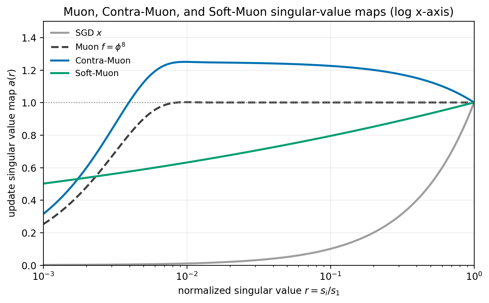

# Contra-Muon and Soft-Muon

Nilin


Contra-Muon is an exaggeration of Muon which further boost small singular values or apply damping to large singular values of the gradient. The goal is to compensate for the smaller leverage of small singular directions to boost diversity in training. Soft-Muon stacks Muon's Newton-Schultz iterates to instead underweigh the small singular values compared to Muon, a middle ground between SGD and Muon.

## Background

[Muon](https://kellerjordan.github.io/posts/muon/) modifies the momentum gradient of matrix-shaped weights by making all singular values close to 1, thereby boosting the small singular modes. Muon is not only a definition in terms of linear algebra, but also an algorithm which calculcates the update efficiently using Newton-Schultz iteration.


## Boosting the ~~small~~ intermediate[^1] modes further

This note considers the possibility of making Muon even more Muon-like, damping the top singular modes or growing the ~~small~~ intermediate ones. Contra-Muon mainly addresses the relative constributions among the top singular modes. whereas Soft-Muon with `p=0.1` softly damps smaller singular modes relative to standard Muon.




## Contra Muon

Contra Muon is a small modification of Muon: after forming Muon's Newton-Schulz orthogonalized momentum update, subtract a fraction of the operator-normalized momentum gradient:

```python
update =  (1 + contra_muon_coeff) * muon_update - contra_muon_coeff * operator_normalized_momentum_gradient
```

where `0 < contra_muon_coeff <= 1`.


## Soft-Muon

The Newton-Schultz iterates in Muon produce approximations to `f(g)` where `g` is the matrix-shaped gradient, `f(g)` is shorthand for `Uf(D)V` where `UDV` is the SVD of `g`. Here `f` is a function `f(0)=0`, `f((eps,1])=1` where `eps` gets smaller with each iteration. While Muon normally uses the last iterate as an approximation to UV, we can also take linear combinations of the previous iterates to compute other functions of `g`. Contra-Muon can be considerd a special case where we use the 0'th and last iterate. 

When we take a convex combination on NS iterates we will call it **Soft-Muon**. The plots below show cumulative linear combinations used to approximate functions, starting from the highest-order iterate. On the right is an example of soft-muon used to approximate power function of the singular values. Power function transformations of the singular values with p<1 are called [HTMuon](https://arxiv.org/abs/2603.10067)[^2].


## Reasoning for boosting small singular values beyond Muon

Let

```text
G = sum_i s_i u_i v_i^T
```

be the SVD of the gradient, estimated in practice by the momentum buffer. Suppose the update is

```text
U = sum_i a_i m_i,    where m_i = u_i v_i^T.
```

Then the `a_i m_i` component contributes approximately `a_i s_i` to the first-order loss change. In momentum SGD, larger singular directions therefore contribute quadratically more to the loss change. In Muon, larger singular directions still contribute more, but only linearly.


Contra Muon with coefficient `1` makes the largest singular directions contribute approximately the same amount to the loss change, to first order. If

```text
r_i = s_i / s_1,
```

then Contra Muon uses

```text
a_i = 2 - r_i.
```

The contribution is therefore proportional to

```text
f(r_i) = r_i * (2 - r_i) = 2r_i - r_i^2.
```

Since `f'(1) = 0`, this contribution is approximately flat near the top singular
value, where `r_i ~= 1`.

## Results
As a proof of concept I used Contra-Muon in modded-nanogpt track 3: https://github.com/KellerJordan/modded-nanogpt/pull/275, producing a record run. I later used a contra-muon to soft-muon schedule to get to the 3030-step record.

[^1]: fixed wording from small to intermediate based on feedback from You Jiacheng
[^2]: [HTMuon](https://arxiv.org/abs/2603.10067) means a power function transformation 0<p<1 of singular values. Soft-muon linear combinations can be used to approximate HTMuon. The [HTMuon paper](https://arxiv.org/abs/2603.10067) exhibits an alternative approximation using iterated approximate matrix square roots.
