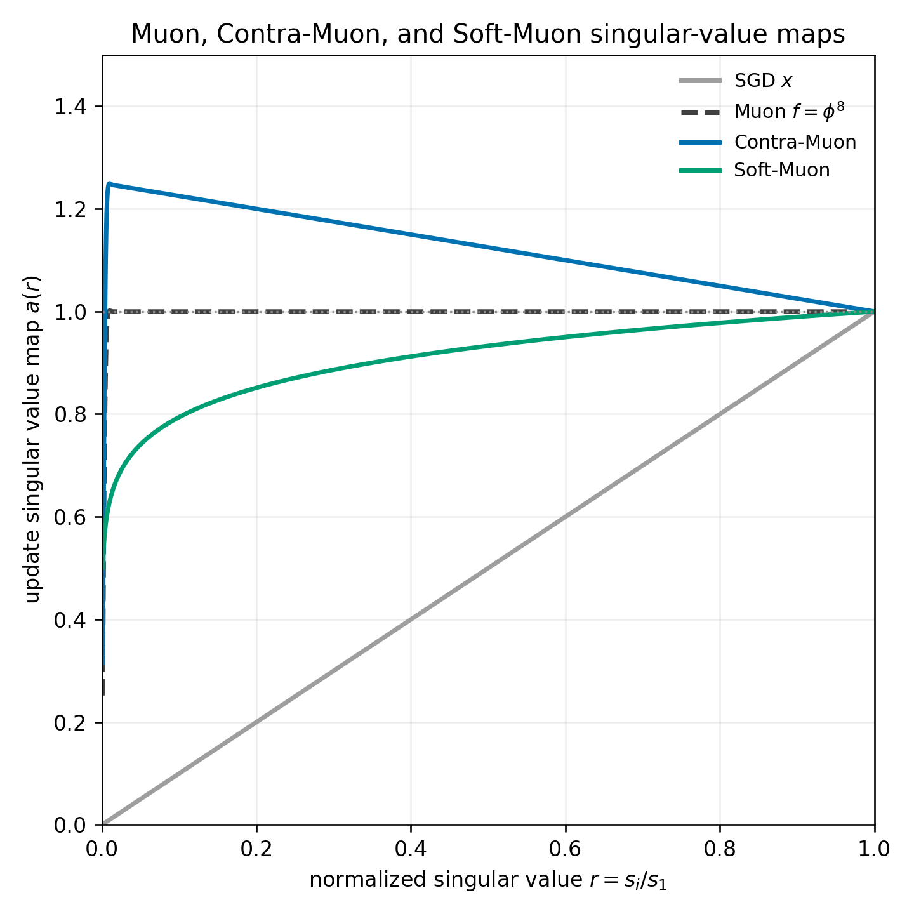

# Contra-Muon and Soft-Muon

Nilin

Contra-Muon and Soft-Muon are exaggerations of Muon which further boost small
singular values or damp large singular values of the gradient. The goal is to
compensate for the smaller leverage of small singular directions and boost
diversity in training.

## Background

[Muon](https://kellerjordan.github.io/posts/muon/) modifies the momentum
gradient of matrix-shaped weights by making all singular values close to 1,
thereby boosting the small singular modes. Muon is both a linear-algebraic
definition and an efficient algorithm based on Newton-Schulz iteration.

## Boosting the Small Modes Further

This note considers the possibility of making Muon even more Muon-like: damping
the top singular modes or growing the small ones. Contra-Muon mainly addresses
the relative contributions among the top singular modes, whereas Soft-Muon with
`p = 0.1` softly damps smaller singular modes relative to standard Muon.



## Contra-Muon

Contra-Muon is a small modification of Muon: after forming Muon's
Newton-Schulz-orthogonalized momentum update, subtract a fraction of the
operator-normalized momentum gradient:

```python
update = (1 + contra_muon_coeff) * muon_update - contra_muon_coeff * operator_normalized_momentum_gradient
```

where `0 < contra_muon_coeff <= 1`.

## Soft-Muon

The Newton-Schulz iterates in Muon produce approximations to `f(g)`, where `g`
is the matrix-shaped gradient and `f(g)` is shorthand for `U f(D) V` when
`U D V` is the SVD of `g`. Muon normally uses the last iterate as an
approximation to `U V`, but we can also take linear combinations of the previous
iterates to compute other functions of `g`.

Contra-Muon can be considered a special case where we use the 0th and last
iterate. More generally, we are interested in power functions `x^p` where
`-1 <= p < 1`. Standard Muon corresponds to `p = 0`.

The Soft-Muon fits are built by summing Newton-Schulz iterates. The next plots
show the cumulative linear combination for `p=-0.2` and `p=0.2`, starting from
the highest-order iterate and adding lower-order iterates until the final
approximation is reached.


## Reasoning for Boosting Small Singular Values Beyond Muon

Let

```text
G = sum_i s_i u_i v_i^T
```

be the SVD of the gradient, estimated in practice by the momentum buffer.
Suppose the update is

```text
U = sum_i a_i m_i,    where m_i = u_i v_i^T.
```

Then the `a_i m_i` component contributes approximately `a_i s_i` to the
first-order loss change. In momentum SGD, larger singular directions therefore
contribute quadratically more to the loss change. In Muon, larger singular
directions still contribute more, but only linearly.


Contra-Muon with coefficient `1` makes the largest singular directions
contribute approximately the same amount to the loss change, to first order. If

```text
r_i = s_i / s_1
```

then Contra-Muon uses

```text
a_i = 2 - r_i.
```

The contribution is therefore proportional to

```text
f(r_i) = r_i * (2 - r_i) = 2r_i - r_i^2.
```

Since `f'(1) = 0`, this contribution is approximately flat near the top
singular value, where `r_i ~= 1`.

## Results

As a proof of concept, I used Contra-Muon in modded-nanogpt track 3, producing a
record run: <https://github.com/KellerJordan/modded-nanogpt/pull/275>.
